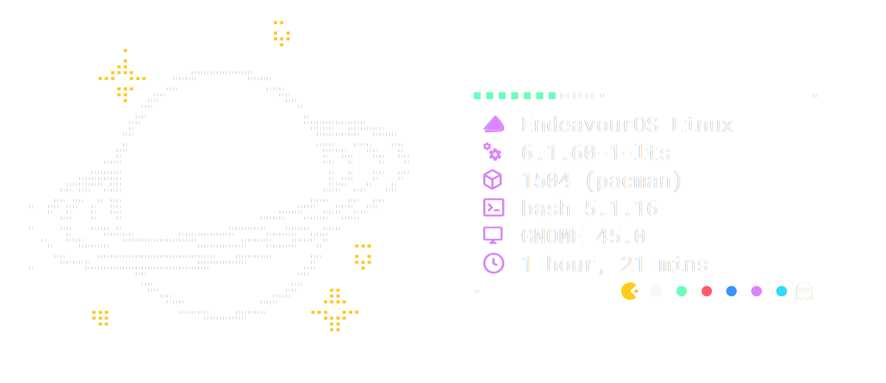
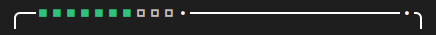
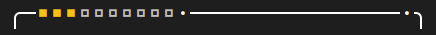
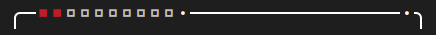
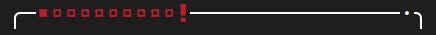
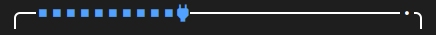
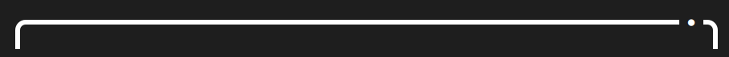
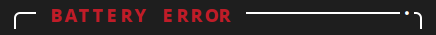
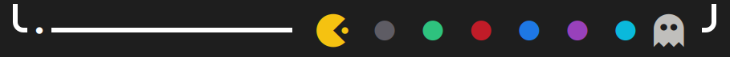

# Battery-Neofetch

<div align="center" style="margin-top: 25px">

Fully compatible <a href="https://github.com/dylanaraps/neofetch">neofetch</a> configuration with custom scripted 
battery and color bar.



<div style="margin-top: 15px">


</div>

</div>

## Features

Why this is more than just a simple neofetch configuration:

### Battery bar

<div style="position:relative; left: 5%; margin-top: 25px">

<b>Draining Battery</b><br>


<b>Below 30%</b><br>


<b>Below 20%</b><br>


<b>Below 10%</b><br>


<b>Charging</b><br>


<b>Full and plugged in</b><br>


<b>Disabled</b><br>


<b>Battery not found</b><br>


</div>

### Bottom bar

<div style="position:relative; left: 5%; margin-top: 25px">

<b>Colorful Pacman themed bar</b>


</div>

### Other

- Planet ASCII-art with colorful stars
- Extendable with own configs

## How to install

Open a bash prompt and execute the code below.
It will create a backup of your current neofetch config.

```shell
git clone https://github.com/Biscgit/battery-neofetch.git
cd battery-neofetch
chmod +x install.sh
./install.sh
```

**NOTE: install.sh is a WIP**

Check installation by typing `neofetch` into the command prompt and switch the Distro Icon to your preferred one.
> [!IMPORTANT]
> You need to have Nerdfonts installed on your machine.

Finally, you can configure the settings in the configuration file as your needs fit.

> [!NOTE]
> If "Battery error" shows up on running `neofetch`,
> check if the correct battery has been selected in the configuration file.

## ToDo's

- [x] Battery bar icons
- [x] Fix bar when battery charge is limited
- [ ] Create simple install script
- [ ] Make example images better looking
- [ ] Option to make stars the same color as the battery bar

## Thank you

<div align="center">

Feel free to submit suggestions!<br>
<sub>(No warranties on anything provided, run at your own risk.)</sub>

<br>

</div>
